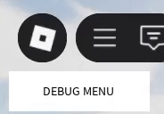
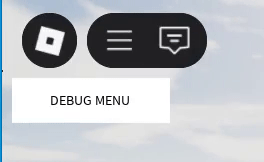
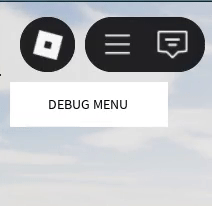
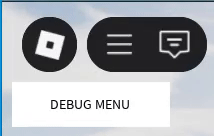
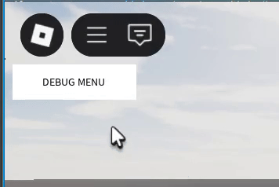

# UIAnimations

Script that provides convenient functions for UI animations.

## Location: _`ReplicatedStorage/Scripts/Modules/UI/UIAnimations`_

## Services and Dependencies

* `TweenService`&#x20;

## Functions

* `tweenProperty(target, properties, duration, easingStyle, easingDirection)` _**(local function)**_

Function that helps with setting up tweens quickly in animation functions. It is local function for that module.

* `fade_in(uiElement, duration)`&#x20;

Changes transparency of UI element from 0 to 1 in given `duration` of time.

<figure><figcaption><p>fade in animation</p></figcaption></figure>


* `fade_out(uiElement, duration)`&#x20;

Changes transparency of UI element from 1 to 0 in given `duration` of time.

<figure><figcaption><p>fade out animation</p></figcaption></figure>


* `scale(uiElement, fromScale, toScale, duration)`&#x20;

Changes scale of UI element from `fromScale` to `toScale` in given `duration` of time.

<figure><figcaption><p>scale animation</p></figcaption></figure>


* `slide(uiElement, direction, distance, duration)`&#x20;

Slides an element into given `direction` for set `distance` in  `duration` of time provided. Used for 'slide in' and 'slideo out' animations.

<figure><figcaption><p>Slide right and left animations</p></figcaption></figure>


* `rotate(uiElement, angle, duration)`&#x20;

Rotates object to a set angle. It **sets** angle of UI element with an animation of rotation.

<figure><figcaption><p>Rotate Animation</p></figcaption></figure>


* `pulse(uiElement, scaleFactor, duration)`&#x20;

Plays pulse animation for set duration of time.

<figure><figcaption><p>Pulse Animation</p></figcaption></figure>

&#x20;

* `assign_animation(animationFn, eventName, uiElement, once)`&#x20;

Assigns an animation function to given event. Set `once` to true if you want animation to be played only once. Default value of `once` parameter is false, animation is played every time given event is triggered. Provide a string name for `eventName` parameter.  `animationFn` is any function from [uianimations.md](uianimations.md "mention") module.

<figure><figcaption><p>MouseEnter and MouseLeave assigned animations</p></figcaption></figure>

## Example of Usage

```lua
-- Load the UIAnimations module
local UIAnimations = require(game.ReplicatedStorage.Scripts.Modules.UI.UIAnimations)

-- Assume this is a TextButton or Frame in your UI
local button = script.Parent

-- Fade Out: make it invisible over 1 second
UIAnimations.fade_out(button, 1)

-- Wait and then fade in
wait(2)
UIAnimations.fade_in(button, 0.5)

-- Scale: animate from 50% size to full size over 0.8 seconds
UIAnimations.scale(button, 0.5, 1, 0.8)

-- Slide: move button to the right by 100 pixels over 1 second
UIAnimations.slide(button, "right", 100, 1)

-- Wait and slide it back to the left
wait(1.5)
UIAnimations.slide(button, "left", 100, 1)

-- Rotate: turn the button to 45 degrees over 0.6 seconds
UIAnimations.rotate(button, 45, 0.6)

-- Pulse: expand size to 120% then back to normal in 0.6 seconds total
UIAnimations.pulse(button, 1.2, 0.6)

-- Assign animation to a UI event (MouseEnter)
-- Triggers a pulse every time mouse hovers over button
UIAnimations.assign_animation(function(el)
	UIAnimations.pulse(el, 1.1, 0.4)
end, "MouseEnter", button, false)

-- Another example: fade out only once on first click
UIAnimations.assign_animation(function(el)
	UIAnimations.fade_out(el, 0.5)
end, "MouseButton1Click", button, true)

```

