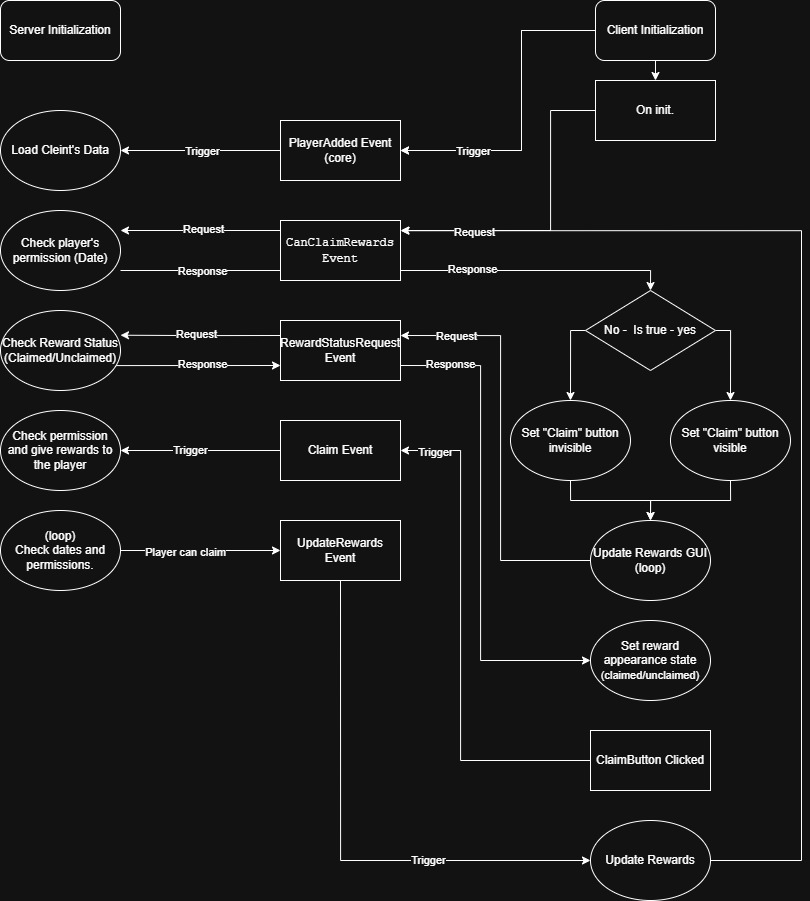

# Daily Rewards System

System responsible for giving player a reward once a day. Used for encouraging player to return for the reward the following day.

## Current functions are:

* Keep track of claimed rewards
* Give rewards to player once claimed
* Keep track of last time

## Configuration

[dailyrewardsconfiguration.md](../../../replicatedstorage-scripts/replicatedstorage/scripts/configuration/dailyrewardsconfiguration.md "mention") - Location:

`ReplicatedStorage/Scripts/Configuration/DailyRewardsConfiguration`

## Scripts and components:

* [dailyrewardsmanager.md](../../../server-scripts/serverscriptservice/rewards/dailyrewardsmanager.md "mention") - Location: `ServerScriptService/Rewards/DailyRewardsManager`
* [rewardinfoupdater.md](../../../ui-scripts/startergui/rewards/rewardinfoupdater.md "mention") - Location: `GUI/Rewards/RewardInfoUpdater`
* [rewards](../../../ui-scripts/startergui/rewards/ "mention") (GUI) - Location: `GUI/Rewards`
* [dailyrewards.md](../../../datastores/datastores/dailyrewards.md "mention") (Datastore) - Location: -
* [canclaimrewards.md](../../../replicatedstorage-scripts/replicatedstorage/events/dailyrewards/canclaimrewards.md "mention")(Event) - Location: `ReplicatedStorage/Events/DailyRewards/CanClaimRewards`
* &#x20;[claim.md](../../../replicatedstorage-scripts/replicatedstorage/events/dailyrewards/claim.md "mention")(Event) - Location: `ReplicatedStorage/Events/DailyReward/Claim`
* &#x20;[getrewardstatus.md](../../../replicatedstorage-scripts/replicatedstorage/events/dailyrewards/getrewardstatus.md "mention")(Event) - Location: `ReplicatedStorage/Events/DailyRewards/GetRewardStatus`
* [updaterewards.md](../../../replicatedstorage-scripts/replicatedstorage/events/dailyrewards/updaterewards.md "mention")(Event) - Location: `ReplicatedStorage/Events/DailyRewards/UpdateRewards`

## Interactions and functions

*   DailyRewardsManager (Server Side) - responsible for :&#x20;

    * Managing datastore (Saving\&Loading data)
    * Verify claim permission (whether player can claim or cannot claim specific reward)
    * Updating claim permissions (live)
    * Responding to client requests (mainly events)

* RewardInfoUpdater (Client Side) - responsible for:
  * Updating GUI with reward info

<figure><figcaption>
System logic
</figcaption></figure>
